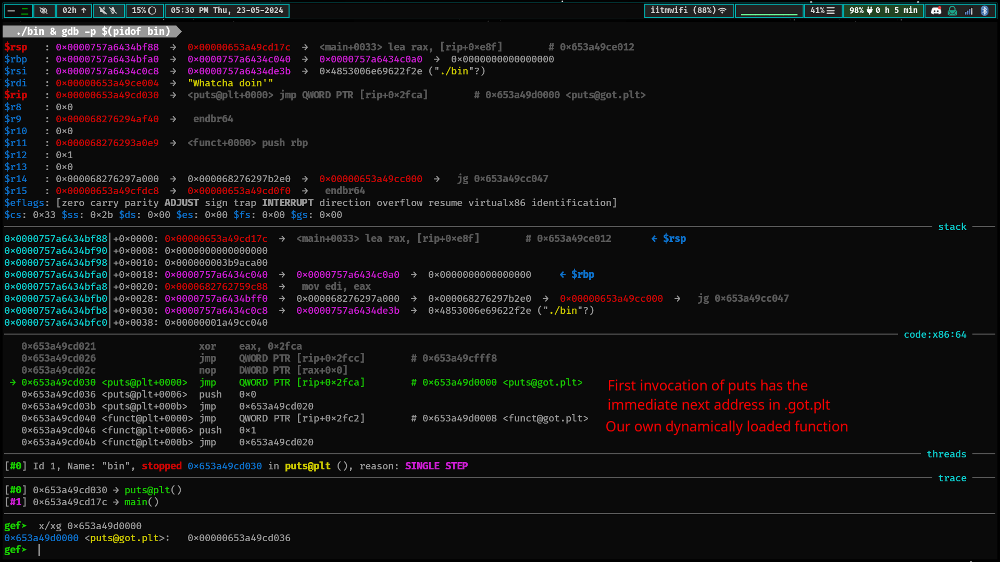
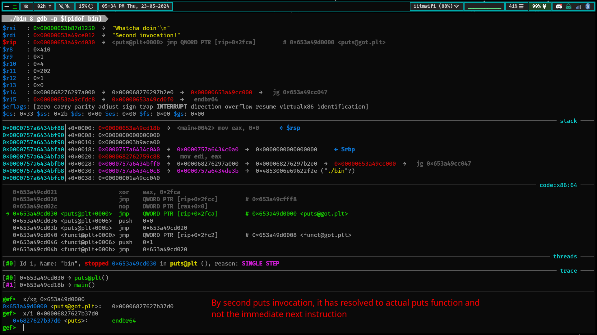

# Compilation, GOT, and PLT

To compile the shared library, run the following commands:

```bash
# this creates a position independent object file
gcc -c -fPIC shared_lib.c
# this creates the shared object file from the object file
gcc -shared shared_lib.o -o libshared.so
# this compiles the main file into PI object file
gcc -c -fPIC file.c
# this gives you the final executable
gcc -L $(pwd) -o such_a_unique_name file.o -l shared
# this tells the dynamic linker to search the current directory while executing
export LD_LIBRARY_PATH=$(pwd):$LD_LIBRARY_PATH
```

Change the value of `/proc/sys/kernel/yama/ptrace_scope` to 0 in linux. Change it
back later to 1.

It will execute an empty while loop for some time and you can attach gdb to it
in the meantime. To do so, run `./such_a_unique_name & gdb -p $(pidof such_a_unique_name)`

This will attach gdb to the running process and let you view the execution.
Set up a breakpoint right before the first `call puts@plt`. Step into the
function call and see the very first instruction.

`0x7970cf2c030 <puts@plt+0000>  jmp    QWORD PTR [rip+0x2fca]        # 0x7970cf2f000 <puts@got.plt>`

This is the first jump from the `.plt` section to the `.got.plt` section.

It loads the value that is located at `$rip + 0x2fca` and jumps to it.





______________________________________________________________________

## How GOT works

Assume that for the time being we only have to deal with global variables in
shared libraries.

While the binary is being loaded by the OS and hasn't started execution yet,
the locations of these variables are resolved and stored in the `.got` section.
This section then becomes read-only.

Then the rest depends on what the status of `RELRO` (Relocation Read-Only) is.
If it is partial, then the function list in `.got.plt` is resolved at runtime.
If it's complete, then all the functions are resolved while the binary is still
loaded. However the latter is very slow for binary startup times.

## How the jumping works

Refer to the pictures above.

## Where are all these things??

The `.got`, `.got.plt` and `.plt` all reside at a constant offset from `.text`.

## Misc

If PIC is off for the **main executable**, (basically `file.c`), then all this
is at a constant offset from stack and *Overwrite GOT* attacks become possible
using format string. We'll cover this some later day.

If `RELRO` is full, then `.got` and `.got.plt` are both read-only and this
method of exploitation wouldn't work.

To check the security measures of binary, run `pwn checksec bin`. This gives you
a bunch of useful info. Assuming pwntools is installed.

To get what the permissions of a binary during runtime will be, run
`readelf -S bin`. It has the key at the bottom.
